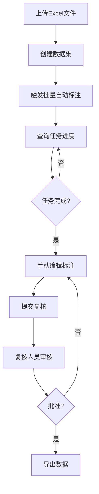
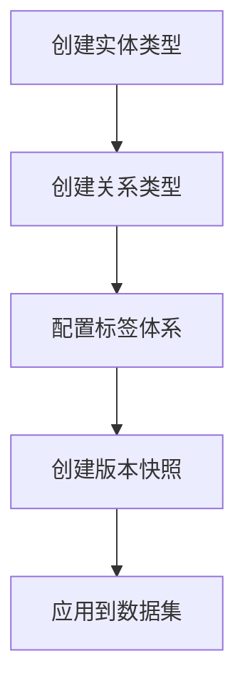

# 前端开发对接指南

**版本**: 1.0  
**更新时间**: 2026-01-19

## 📋 目录

1. [快速开始](#快速开始)
2. [后端服务信息](#后端服务信息)
3. [API概览](#api概览)
4. [认证流程](#认证流程)
5. [核心业务流程](#核心业务流程)
6. [数据模型](#数据模型)
7. [错误处理](#错误处理)
8. [开发建议](#开发建议)

---

## 🚀 快速开始

### 启动后端服务

```bash
cd backend
python main.py
```

服务将在 `http://localhost:8000` 启动

### API文档地址

- **Swagger UI**: http://localhost:8000/docs
- **ReDoc**: http://localhost:8000/redoc
- **OpenAPI JSON**: http://localhost:8000/openapi.json

### 测试账号

```json
{
  "username": "admin",
  "password": "admin123",
  "role": "admin"
}
```

---

## 🔧 后端服务信息

### 技术栈

- **框架**: FastAPI 0.104+
- **数据库**: SQLite (开发) / PostgreSQL (生产)
- **认证**: JWT Token
- **AI模型**: OpenAI GPT-4 / 本地模型

### 服务配置

```python
# 默认配置
BASE_URL = "http://localhost:8000"
API_PREFIX = "/api/v1"
```

### 环境变量

创建 `.env` 文件：

```env
# 数据库
DATABASE_URL=<set-this-to-your-active-business-database>

# JWT
SECRET_KEY=your-secret-key-here
ALGORITHM=HS256
ACCESS_TOKEN_EXPIRE_MINUTES=30

# OpenAI (可选)
OPENAI_API_KEY=your-openai-key
OPENAI_BASE_URL=https://api.openai.com/v1
```

---

## 📡 API概览

### 基础URL

```
http://localhost:8000/api/v1
```

### API模块

| 模块 | 路径前缀 | 端点数 | 说明 |
|------|---------|--------|------|
| 认证 | `/auth` | 3 | 登录、登出、获取当前用户 |
| 用户管理 | `/users` | 6 | 用户CRUD、统计 |
| 语料管理 | `/corpus` | 5 | 上传、查询、删除语料 |
| 数据集管理 | `/datasets` | 7 | 数据集CRUD、导出 |
| 标签管理 | `/labels` | 20 | 实体类型、关系类型管理 |
| 标注任务 | `/annotations` | 12 | 批量标注、实体、关系管理 |
| 图片标注 | `/images` | 4 | 图片实体标注 |
| 版本管理 | `/versions` | 5 | 版本历史、回滚、比较 |
| 复核管理 | `/review` | 7 | 提交、批准、驳回、统计 |

**总计**: 69个API端点

详细API文档: [API_DOCUMENTATION.md](../api/API_DOCUMENTATION.md)

---

## 🔐 认证流程

### 1. 登录获取Token

```typescript
// 请求
POST /api/v1/auth/login
Content-Type: application/json

{
  "username": "admin",
  "password": "admin123"
}

// 响应
{
  "access_token": "eyJhbGciOiJIUzI1NiIsInR5cCI6IkpXVCJ9...",
  "token_type": "bearer",
  "user": {
    "id": 1,
    "username": "admin",
    "role": "admin"
  }
}
```

### 2. 使用Token访问API

```typescript
// 在所有请求的Header中添加
Authorization: Bearer <access_token>
```

### 3. 获取当前用户信息

```typescript
GET /api/v1/auth/me
Authorization: Bearer <access_token>

// 响应
{
  "id": 1,
  "username": "admin",
  "role": "admin",
  "created_at": "2024-01-01T00:00:00"
}
```

### 4. 登出

```typescript
POST /api/v1/auth/logout
Authorization: Bearer <access_token>

// 前端需要删除本地存储的token
```

### 前端实现示例

```typescript
// auth.service.ts
class AuthService {
  private token: string | null = null;

  async login(username: string, password: string) {
    const response = await fetch('http://localhost:8000/api/v1/auth/login', {
      method: 'POST',
      headers: { 'Content-Type': 'application/json' },
      body: JSON.stringify({ username, password })
    });
    
    const data = await response.json();
    this.token = data.access_token;
    localStorage.setItem('token', this.token);
    return data;
  }

  getAuthHeader() {
    return {
      'Authorization': `Bearer ${this.token || localStorage.getItem('token')}`
    };
  }

  logout() {
    this.token = null;
    localStorage.removeItem('token');
  }
}
```

---

## 📊 核心业务流程

### 流程1: 完整标注流程



### 流程2: 标签体系管理



### API调用示例

#### 1. 上传语料

```typescript
// 上传Excel文件
const formData = new FormData();
formData.append('file', file);

const response = await fetch('http://localhost:8000/api/v1/corpus/upload', {
  method: 'POST',
  headers: authService.getAuthHeader(),
  body: formData
});

const result = await response.json();
// result.data.corpus_ids: [1, 2, 3, ...]
```

#### 2. 创建数据集

```typescript
const response = await fetch('http://localhost:8000/api/v1/datasets', {
  method: 'POST',
  headers: {
    'Content-Type': 'application/json',
    ...authService.getAuthHeader()
  },
  body: JSON.stringify({
    name: "测试数据集",
    description: "用于测试的数据集",
    corpus_ids: [1, 2, 3],
    created_by: 1,
    label_schema_version_id: null  // 可选
  })
});

const result = await response.json();
// result.data.dataset_id: "DS_001"
```

#### 3. 触发批量标注

```typescript
const response = await fetch('http://localhost:8000/api/v1/annotations/batch', {
  method: 'POST',
  headers: {
    'Content-Type': 'application/json',
    ...authService.getAuthHeader()
  },
  body: JSON.stringify({
    dataset_id: "DS_001",
    annotation_type: "auto",  // auto | manual
    assigned_to: 1
  })
});

const result = await response.json();
// result.data.job_id: "JOB_001"
```

#### 4. 查询批量任务进度

```typescript
const response = await fetch(
  `http://localhost:8000/api/v1/annotations/batch/JOB_001`,
  {
    headers: authService.getAuthHeader()
  }
);

const result = await response.json();
/*
{
  "job_id": "JOB_001",
  "status": "processing",  // pending | processing | completed | failed
  "progress": {
    "total": 100,
    "completed": 45,
    "failed": 0
  },
  "started_at": "2024-01-01T10:00:00",
  "completed_at": null
}
*/
```

#### 5. 获取标注任务详情

```typescript
const response = await fetch(
  `http://localhost:8000/api/v1/annotations/TASK_001`,
  {
    headers: authService.getAuthHeader()
  }
);

const result = await response.json();
/*
{
  "task_id": "TASK_001",
  "corpus": {
    "text_id": "CORP_001",
    "text": "原始文本内容...",
    "images": [...]
  },
  "text_entities": [
    {
      "entity_id": 0,
      "token": "实体文本",
      "label": "Product",
      "start_offset": 10,
      "end_offset": 14
    }
  ],
  "relations": [
    {
      "relation_id": 0,
      "from_entity_id": 0,
      "to_entity_id": 1,
      "relation_type": "has_defect"
    }
  ],
  "status": "pending",
  "current_version": 1
}
*/
```

#### 6. 更新实体

```typescript
const response = await fetch(
  `http://localhost:8000/api/v1/annotations/TASK_001/entities/0`,
  {
    method: 'PUT',
    headers: {
      'Content-Type': 'application/json',
      ...authService.getAuthHeader()
    },
    body: JSON.stringify({
      token: "修改后的文本",
      label: "NewLabel",
      start_offset: 10,
      end_offset: 16
    })
  }
);
```

#### 7. 提交复核

```typescript
const response = await fetch(
  `http://localhost:8000/api/v1/review/submit/TASK_001`,
  {
    method: 'POST',
    headers: authService.getAuthHeader()
  }
);

const result = await response.json();
// result.review_id: "REV_001"
```

---

## 📦 数据模型

### 用户 (User)

```typescript
interface User {
  id: number;
  username: string;
  role: 'admin' | 'annotator' | 'reviewer';
  created_at: string;
}
```

### 语料 (Corpus)

```typescript
interface Corpus {
  id: number;
  text_id: string;
  text: string;
  text_type: string;
  source_file: string;
  source_row: number;
  source_field: string;
  has_images: boolean;
  images?: Image[];
}
```

### 图片 (Image)

```typescript
interface Image {
  id: number;
  image_id: string;
  corpus_id: number;
  file_path: string;
  original_name: string;
  width: number;
  height: number;
}
```

### 数据集 (Dataset)

```typescript
interface Dataset {
  id: number;
  dataset_id: string;
  name: string;
  description: string;
  label_schema_version_id?: number;
  created_by: number;
  created_at: string;
  updated_at: string;
}
```

### 标注任务 (AnnotationTask)

```typescript
interface AnnotationTask {
  id: number;
  task_id: string;
  dataset_id: number;
  corpus_id: number;
  status: 'pending' | 'in_progress' | 'completed' | 'reviewed';
  annotation_type: 'auto' | 'manual';
  assigned_to: number;
  current_version: number;
  created_at: string;
  updated_at: string;
}
```

### 文本实体 (TextEntity)

```typescript
interface TextEntity {
  id: number;
  entity_id: number;  // 任务内唯一ID
  task_id: number;
  version: number;
  token: string;
  label: string;
  start_offset: number;
  end_offset: number;
}
```

### 关系 (Relation)

```typescript
interface Relation {
  id: number;
  relation_id: number;  // 任务内唯一ID
  task_id: number;
  version: number;
  from_entity_id: number;
  to_entity_id: number;
  relation_type: string;
}
```

### 图片实体 (ImageEntity)

```typescript
interface ImageEntity {
  id: number;
  entity_id: number;
  image_id: number;
  task_id: number;
  version: number;
  label: string;
  annotation_type: 'whole_image' | 'region';
  bbox?: {
    x: number;
    y: number;
    width: number;
    height: number;
  };
}
```

### 实体类型 (EntityType)

```typescript
interface EntityType {
  id: number;
  type_name: string;
  type_name_zh: string;
  color: string;
  description?: string;
  is_active: boolean;
}
```

### 关系类型 (RelationType)

```typescript
interface RelationType {
  id: number;
  type_name: string;
  type_name_zh: string;
  color: string;
  description?: string;
  is_active: boolean;
}
```

---

## ⚠️ 错误处理

### HTTP状态码

| 状态码 | 说明 | 处理方式 |
|--------|------|----------|
| 200 | 成功 | 正常处理响应数据 |
| 400 | 请求参数错误 | 显示错误信息，检查请求参数 |
| 401 | 未认证 | 跳转到登录页 |
| 403 | 权限不足 | 显示权限不足提示 |
| 404 | 资源不存在 | 显示资源不存在提示 |
| 500 | 服务器错误 | 显示服务器错误，联系管理员 |

### 错误响应格式

```typescript
interface ErrorResponse {
  detail: string;  // 错误描述
}
```

### 前端错误处理示例

```typescript
async function apiCall(url: string, options: RequestInit) {
  try {
    const response = await fetch(url, options);
    
    if (!response.ok) {
      const error = await response.json();
      
      switch (response.status) {
        case 401:
          // 未认证，跳转登录
          authService.logout();
          router.push('/login');
          break;
        case 403:
          // 权限不足
          showError('权限不足');
          break;
        case 404:
          // 资源不存在
          showError('资源不存在');
          break;
        default:
          // 其他错误
          showError(error.detail || '请求失败');
      }
      
      throw new Error(error.detail);
    }
    
    return await response.json();
  } catch (error) {
    console.error('API调用失败:', error);
    throw error;
  }
}
```

---

## 💡 开发建议

### 1. API封装

建议创建统一的API服务层：

```typescript
// api/base.ts
export class ApiService {
  private baseURL = 'http://localhost:8000/api/v1';
  
  async request(endpoint: string, options: RequestInit = {}) {
    const url = `${this.baseURL}${endpoint}`;
    const headers = {
      'Content-Type': 'application/json',
      ...authService.getAuthHeader(),
      ...options.headers
    };
    
    return apiCall(url, { ...options, headers });
  }
  
  get(endpoint: string) {
    return this.request(endpoint, { method: 'GET' });
  }
  
  post(endpoint: string, data: any) {
    return this.request(endpoint, {
      method: 'POST',
      body: JSON.stringify(data)
    });
  }
  
  put(endpoint: string, data: any) {
    return this.request(endpoint, {
      method: 'PUT',
      body: JSON.stringify(data)
    });
  }
  
  delete(endpoint: string) {
    return this.request(endpoint, { method: 'DELETE' });
  }
}

export const api = new ApiService();
```

### 2. 状态管理

建议使用状态管理库（Vuex/Pinia/Redux）管理：
- 用户认证状态
- 当前数据集
- 标注任务列表
- 标签体系配置

### 3. 实时更新

对于批量任务进度，建议使用轮询或WebSocket：

```typescript
// 轮询示例
function pollJobStatus(jobId: string) {
  const interval = setInterval(async () => {
    const status = await api.get(`/annotations/batch/${jobId}`);
    
    if (status.status === 'completed' || status.status === 'failed') {
      clearInterval(interval);
      // 处理完成或失败
    }
    
    // 更新进度UI
    updateProgress(status.progress);
  }, 2000);  // 每2秒查询一次
}
```

### 4. 文件上传

```typescript
async function uploadFile(file: File) {
  const formData = new FormData();
  formData.append('file', file);
  
  const response = await fetch('http://localhost:8000/api/v1/corpus/upload', {
    method: 'POST',
    headers: authService.getAuthHeader(),
    body: formData  // 不要设置Content-Type，让浏览器自动设置
  });
  
  return await response.json();
}
```

### 5. 分页处理

```typescript
interface PaginationParams {
  page: number;
  page_size: number;
}

interface PaginatedResponse<T> {
  items: T[];
  total: number;
  page: number;
  page_size: number;
}

async function getCorpusList(params: PaginationParams) {
  const query = new URLSearchParams({
    page: params.page.toString(),
    page_size: params.page_size.toString()
  });
  
  return api.get(`/corpus?${query}`);
}
```

### 6. 缓存策略

建议对以下数据进行缓存：
- 标签体系配置（实体类型、关系类型）
- 用户信息
- 数据集列表

### 7. 开发工具

推荐使用：
- **Postman/Insomnia**: API测试
- **Swagger UI**: 在线API文档和测试
- **Vue DevTools/React DevTools**: 前端调试

---

## 📚 相关文档

- [API详细文档](../api/API_DOCUMENTATION.md)
- [数据库模型](../models/db_models.py)
- [数据模式](../models/schemas.py)
- [测试状态](./testing/TEST_STATUS.md)

---

## 🔗 快速链接

- **Swagger UI**: http://localhost:8000/docs
- **ReDoc**: http://localhost:8000/redoc
- **健康检查**: http://localhost:8000/health

---

*最后更新: 2026-01-19*
